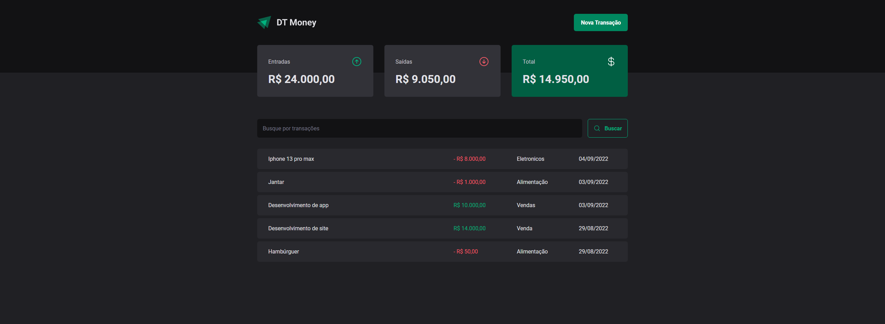
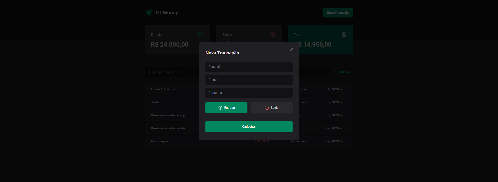

# DTMoney

### Skills importantes no projeto:
<ul>
  <li>React</li>
  <li>Styled-Components</li>
  <li>useContextSelector</li>
  <li>Radix components</li>
  <li>React hook form</li>
</ul>

### Home

  

## Modal de transações

  

